python -m venv myvenv
myvenv\Scripts\activate.bat
cd Meeting-Flask-Program
mkdir app
cd app
cd . > __init__.py
cd . > main.py
mkdir templates
mkdir static
mkdir static/css
mkdir static/js
mkdir static/img
cd . > static/css/style.css
cd . > static/js/script.js
cd . > static/img/logo.png
cd . > static/img/favicon.ico
cd . > templates/index.html
cd . > templates/about.html
cd . > templates/contact.html
cd . > templates/services.html
cd . > templates/login.html
cd . > templates/register.html
cd . > requirements.txt

pip install Flask
pip install --upgrade google-cloud-aiplatform
gcloud auth application-default login

Run application flask
set FLASK_APP=app
flask run

# Remember to Create Project in Google Cloud Platform and Enable API's for AI Platform, Storage, Vision, Text To Speech.
Whisper Specs 

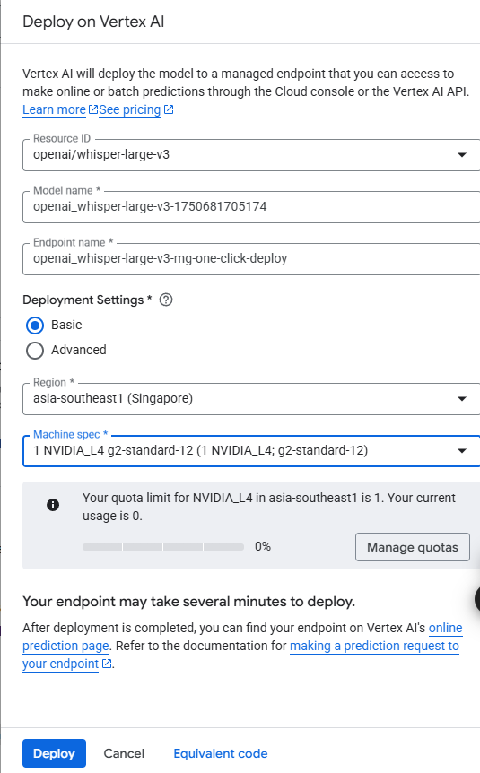

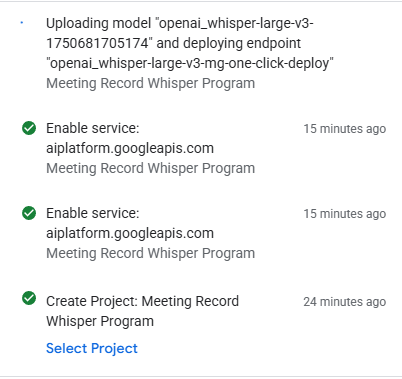

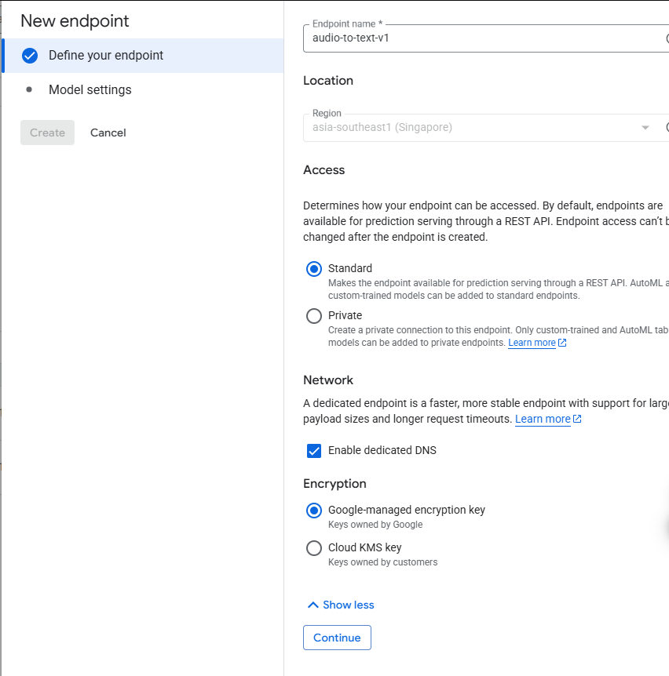

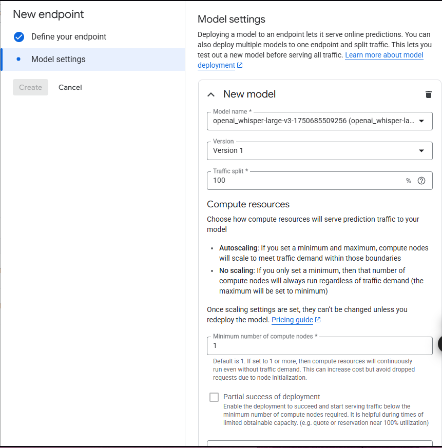

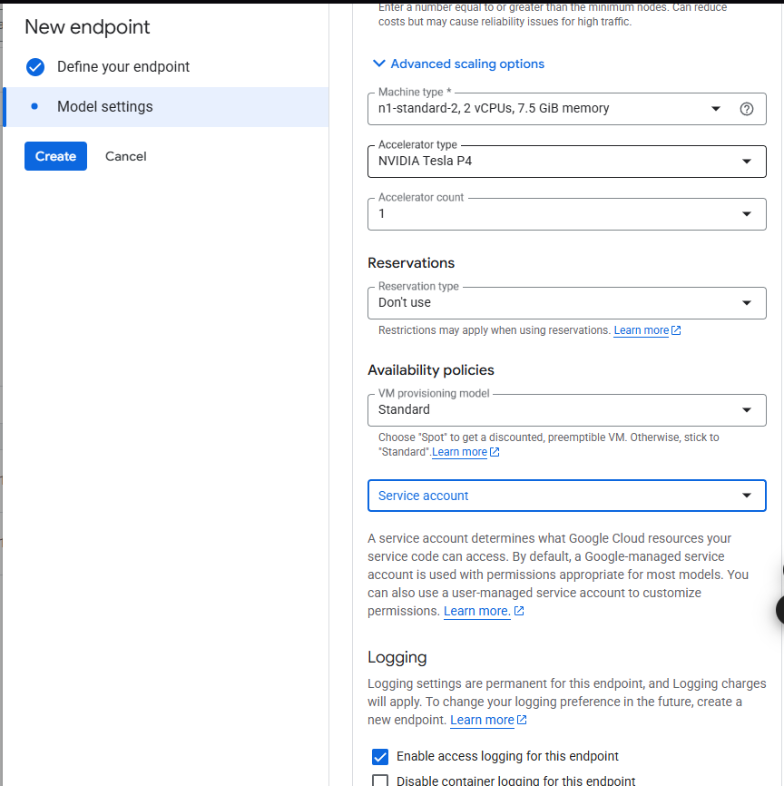

Check Quotas & System limits https://cloud.google.com/vertex-ai/docs/general/quotas

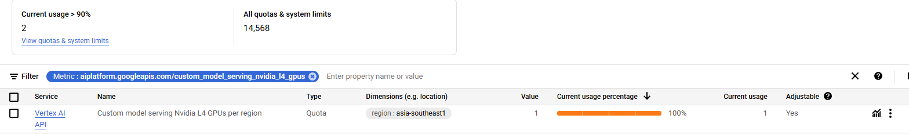

Create credentials

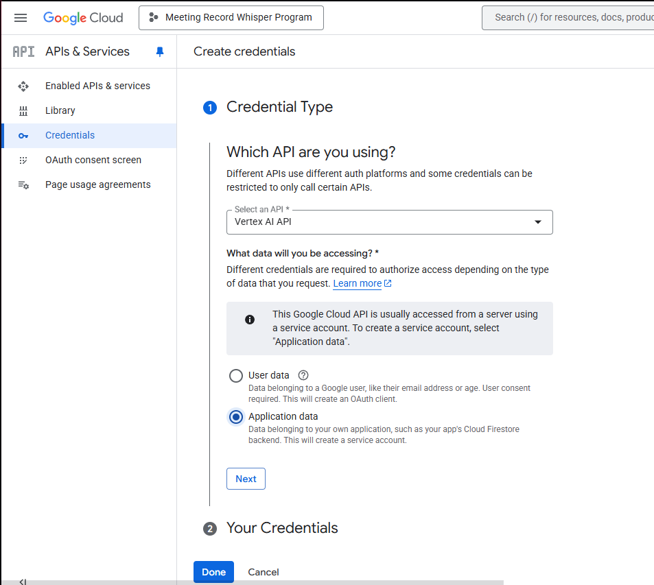

Create OAuth 

https://console.cloud.google.com/auth/overview/create?authuser=0&inv=1&invt=Ab05CQ&project=<name program>

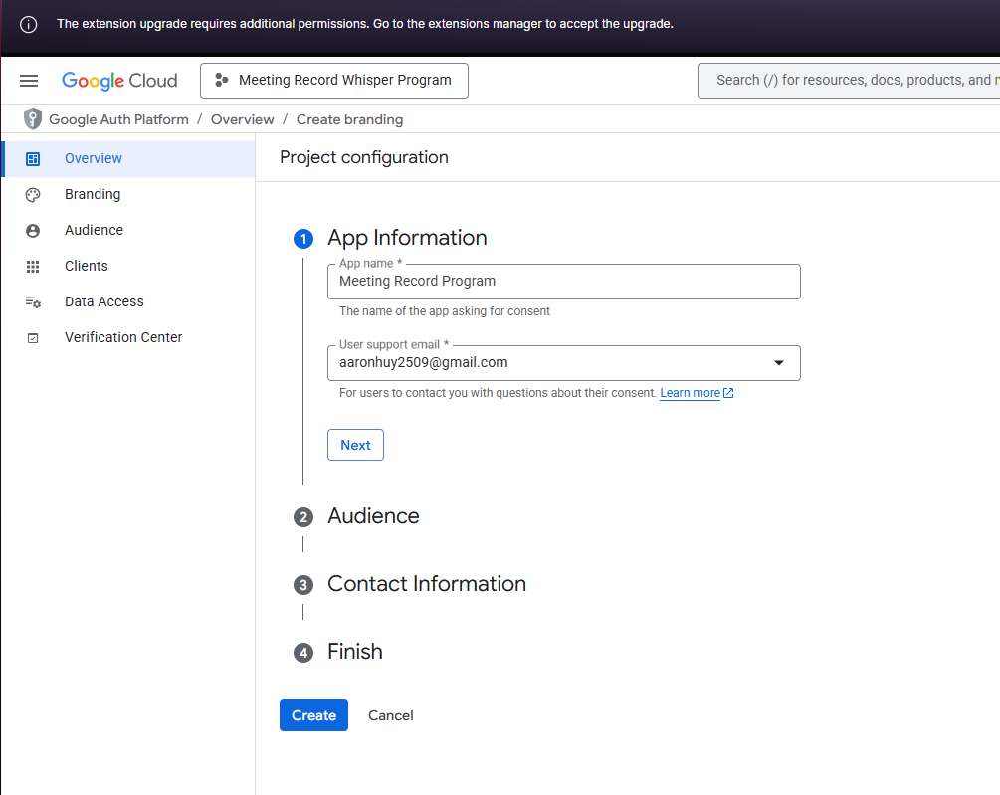

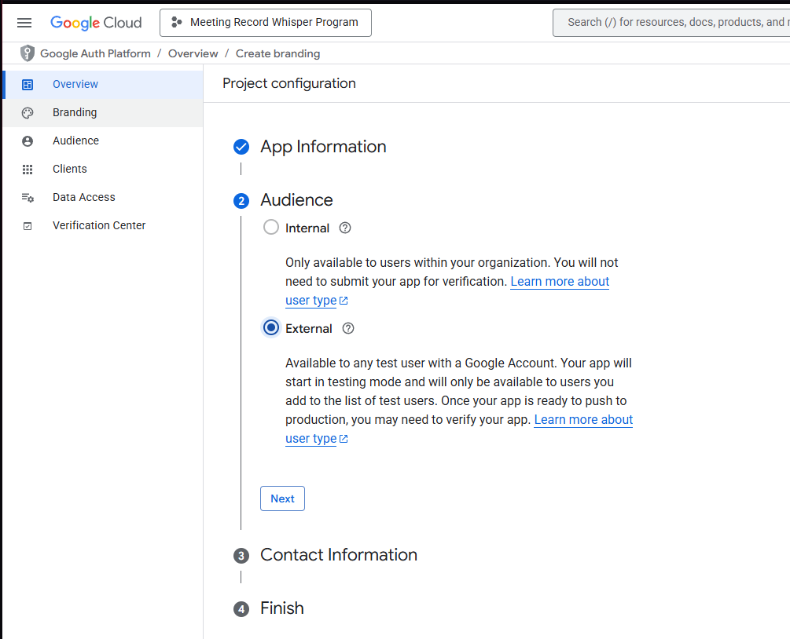

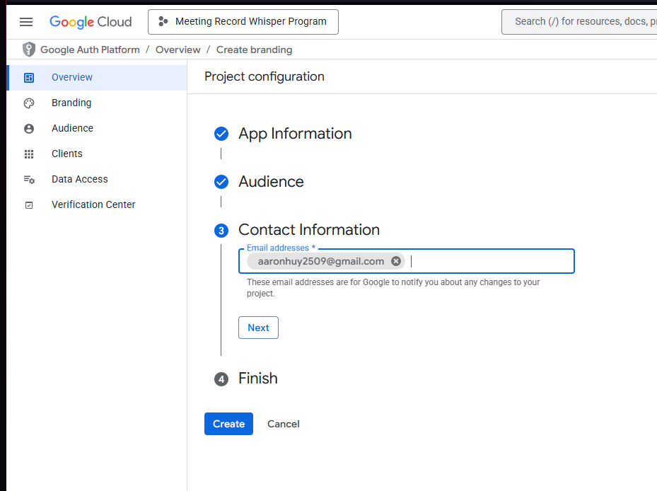

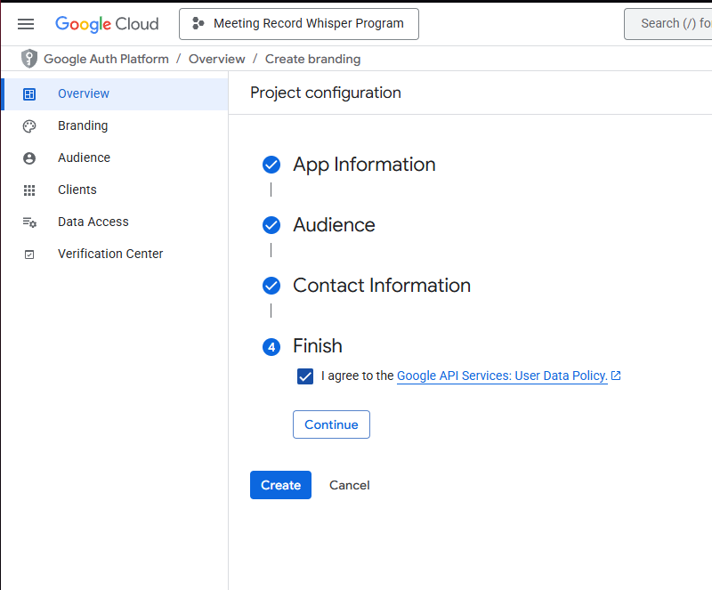

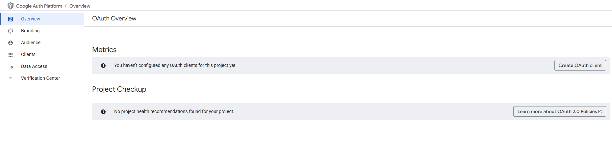

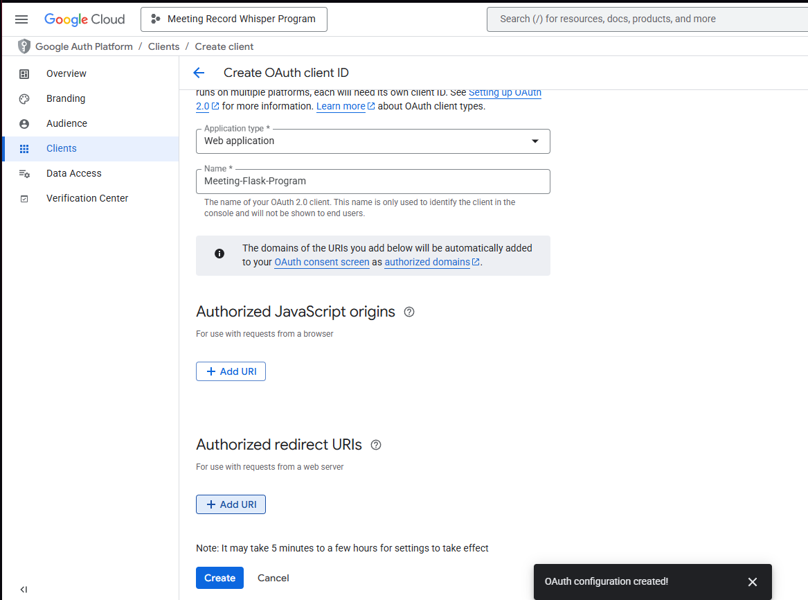

Click on Create then you should get the result

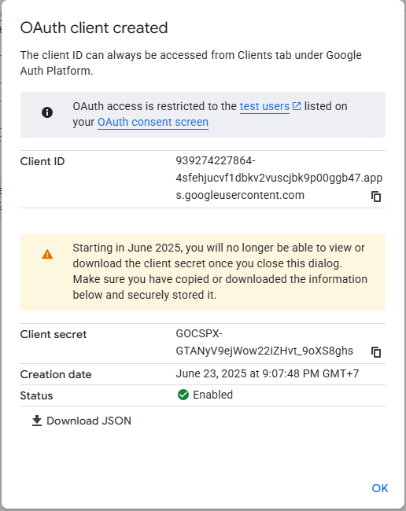